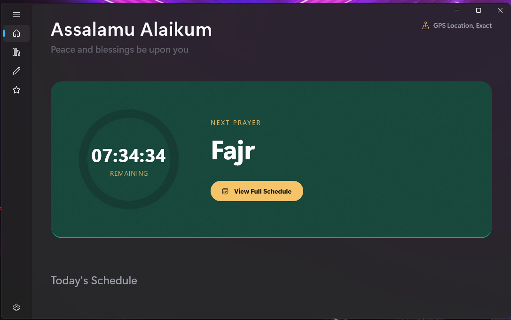
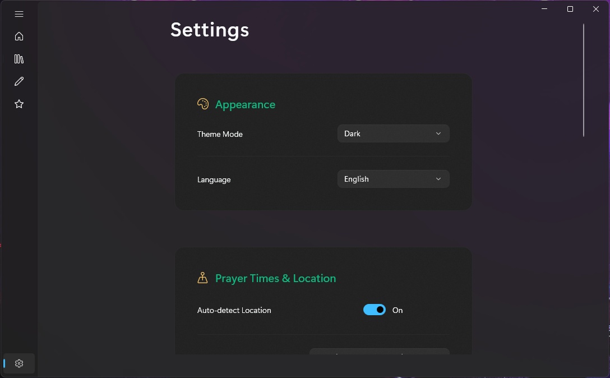

  
  
  # Zakarni (ذكرني)

  **A modern, beautiful, and feature-rich Islamic companion app for Windows.**

  
  
  
  

  

    <a href="#features">Features</a> •
    <a href="#installation">Installation</a> •
    <a href="#screenshots">Screenshots</a> •
    <a href="#tech-stack">Tech Stack</a>
  

---

## ✨ Overview

**Zakarni** is a beautifully designed Windows desktop application crafted to help Muslims stay connected with their faith throughout their daily lives. Built with the latest WinUI 3 framework and .NET 8, it offers a seamless, native, and highly performant experience. 

Whether you need precise prayer times, a quick way to read the Quran, daily Athkar, or a non-intrusive floating widget to keep track of the next prayer, Zakarni has you covered in a luxurious and modern UI.

## 🚀 Features

* 🕌 **Accurate Prayer Times:** Automatically calculates prayer times based on your geographical location with support for various calculation methods and Madhabs.
* ⏱️ **Floating Widget & System Tray:** A discreet, always-on-top floating widget that shows the next prayer and countdown. The app can minimize to the system tray to run quietly in the background.
* 📖 **Quran Reader (المصحف):** Read the Holy Quran seamlessly within the app with a dedicated reading mode.
* 📿 **Daily Athkar (الأذكار):** Access morning, evening, and post-prayer supplications easily.
* ✅ **Islamic Task Manager:** Keep track of your daily religious goals and habits.
* 🔔 **Adhan & Notifications:** Audio Adhan alerts and desktop notifications before and at prayer times.
* 🌓 **Beautiful Theming:** Full support for Windows Light and Dark modes, utilizing Mica backdrops and Acrylic materials for a premium feel.
* 🌍 **Bilingual Support:** Fully localized in both Arabic (RTL) and English (LTR).

## 📸 Screenshots

*(Replace these placeholders with actual screenshots of your application)*

| Dashboard (Dark Mode) | Quran Reader |
|:---:|:---:|
|  |
 |

| Floating Widget | Settings |
|:---:|:---:|
| | |
|  |  |
|||

## 🛠️ Tech Stack

* **Framework:** [WinUI 3 (Windows App SDK)](https://learn.microsoft.com/windows/apps/winui/winui3/)
* **Runtime:** [.NET 8.0](https://dotnet.microsoft.com/)
* **Language:** C# 12
* **Architecture:** MVVM (Model-View-ViewModel) via `CommunityToolkit.Mvvm`
* **Dependency Injection:** `Microsoft.Extensions.DependencyInjection`
* **Key Libraries:**
  * `H.NotifyIcon` (For System Tray functionality)
  * `Adhan.cs` (For prayer time calculations)

## 📦 Installation & Build

### Prerequisites
* Windows 10 (Version 1809 or later) or Windows 11.
* [Visual Studio 2022](https://visualstudio.microsoft.com/) (17.8+) with the **.NET desktop development** and **Windows application development** workloads installed.
* .NET 8.0 SDK.

### How to Download
1. Go to the [Releases page](https://github.com/refa3ydev-dotNet/Zakarni/releases/tag/Zakarni).              │
2. Download the latest `Zakarni.zip` or `.exe` installer.           │
3. Extract the contents (if zip) and run `Zakarni.UI.exe`.   
## 📄 License

This project is licensed under the MIT License - see the [LICENSE](LICENSE) file for details.

---

  <i>"Remember Me; I will remember you." (Quran 2:152)</i>

